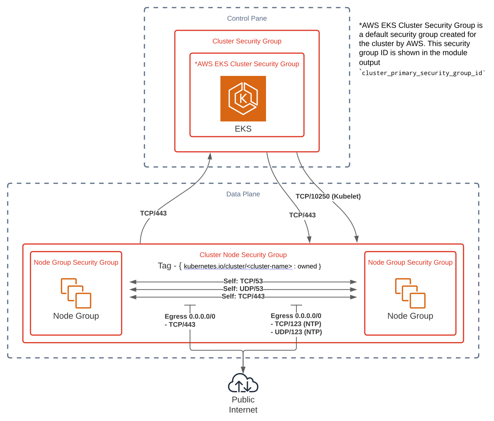

# Security group considerations

The following sections describe the recommended or minimum required security group settings for the cluster, control plane, and node security groups of your cluster. These considerations are dependent on which Kubernetes version and Amazon EKS platform version you use.



## Cluster security group

Amazon EKS clusters, starting with Kubernetes version 1.14 and [platform version](https://docs.aws.amazon.com/eks/latest/userguide/platform-versions.html) `eks.3`, create a cluster security group when they are created. This also happens when a cluster of an earlier version is upgraded to this Kubernetes version and platform version. A cluster security group is designed to allow all traffic from the control plane and [managed node groups](https://docs.aws.amazon.com/eks/latest/userguide/managed-node-groups.html) to flow freely between each other. By assigning the cluster security group to the elastic network interfaces created by Amazon EKS that allow the control plane to communicate with the managed node group instances, you don't need to configure complex security group rules to allow this communication. Any instance or network interface that is assigned this security group can freely communicate with other resources with this security group.

You can check for a cluster security group for your cluster with the following AWS CLI command:

```bash
aws eks describe-cluster --name <cluster-name> --query cluster.resourcesVpcConfig.clusterSecurityGroupId
```

AWS recommends that you add the cluster security group to all existing and future node groups. Amazon EKS [managed node groups](https://docs.aws.amazon.com/eks/latest/userguide/managed-node-groups.html) are automatically configured to use the cluster security group.

|                               | Protocol | Ports | Source | Destination                      |
| ----------------------------- | -------- | ----- | ------ | -------------------------------- |
| Recommended inbound traffic   | All      | All   | Self   |                                  |
| Recommended outbound traffic  | All      | All   |        | 0.0.0.0/0 (IPv4) or ::/0 (IPv6)  |

**Restricting cluster traffic**
If you need to limit the open ports between the control plane and nodes, the default cluster security group can be modified to allow only the following required minimum ports. The required minimum ports are the same as they were in previous Amazon EKS versions.

|                            | Protocol    | Port  | Source                 | Destination            |
| -------------------------- | ----------- | ----- | ---------------------- | ---------------------- |
| Minimum inbound traffic    | TCP         | 443   | Cluster security group |                        |
| Minimum inbound traffic\*  | TCP         | 10250 | Cluster security group |                        |
| CoreDNS                    | TCP and UDP | 53    | Cluster security group |                        |
| Minimum outbound traffic   | TCP         | 443   |                        | Cluster security group |
| Minimum outbound traffic\* | TCP         | 10250 |                        | Cluster security group |
| DNS                        | TCP and UDP | 53    |                        | Cluster security group |

\*Any protocol and ports that you expect your nodes to use for inter-node communication should be included, if required. Nodes also require outbound internet access to the Amazon EKS APIs for cluster introspection and node registration at launch time, or that you've implemented the required necessary settings in [Private clusters](https://docs.aws.amazon.com/eks/latest/userguide/private-clusters.html). To pull container images, they require access to Amazon S3, Amazon ECR APIs, and any other container registries that they need to pull images from, such as DockerHub. For more information, see [AWS IP address ranges](https://docs.aws.amazon.com/general/latest/gr/aws-ip-ranges.html) in the AWS General Reference.

## Control plane and node security groups

For Amazon EKS clusters created earlier than Kubernetes version 1.14 and [platform version](https://docs.aws.amazon.com/eks/latest/userguide/platform-versions.html) `eks.3`, control plane to node communication was configured by manually creating a control plane security group and specifying that security group when you created the cluster. At cluster creation, this security group was then attached to the network interfaces created by Amazon EKS that allow communication between the control plane and the nodes. These network interfaces have `Amazon EKS <cluster-name>` in their description.

**NOTE**
If you used the API directly, or a tool such as AWS CloudFormation to create your cluster and didn't specify a security group, then the default security group for the VPC was applied to the control plane cross-account network interfaces.

You can check the control plane security group for your cluster with the following AWS CLI command:

```bash
aws eks describe-cluster --name <cluster-name> --query cluster.resourcesVpcConfig.securityGroupIds
```

**Amazon EKS strongly recommends that you use a dedicated security group for each control plane (one for each cluster)**. If you share a control plane security group with other Amazon EKS clusters or resources, you may block or disrupt connections to those resources.

The security group for the nodes and the security group for the control plane communication to the nodes have been set up to prevent communication to privileged ports in the nodes. If your applications require added inbound or outbound access from the control plane or nodes, you must add these rules to the security groups associated with your cluster.

**NOTE**
To allow proxy functionality on privileged ports or to run the CNCF conformance tests yourself, you must edit the security groups for your control plane and the nodes. The security group on the nodes' side needs to allow inbound access for ports 0-65535 from the control plane, and the control plane side needs to allow outbound access to the nodes on ports 0-65535.

**Control Plane Security Group**

|                              | Protocol | Port range | Source                     | Destination               |
| ---------------------------- | -------- | ---------- | -------------------------- | ------------------------- |
| Minimum inbound traffic      | TCP      | 443        | All node security groups\* |                           |
| Recommended inbound traffic  | TCP      | 443        | All node security groups\* |                           |
| Minimum outbound traffic     | TCP      | 10250      |                            | All node security groups  |
| Recommended outbound traffic | TCP      | 1025-65535 |                            | All node security groups  |

*When [cluster endpoint private access](https://docs.aws.amazon.com/eks/latest/userguide/cluster-endpoint.html) is enabled: Any security groups that generate API server client traffic (such as `kubectl` commands on a bastion host within your cluster's VPC).

**Node security group**

|                                              | Protocol    | Port range           | Source                                     | Destination                     |
| -------------------------------------------- | ----------- | -------------------- | ------------------------------------------ | ------------------------------- |
| Minimum inbound traffic (from other nodes)   | Any\*       | Any\*                | All node security groups                   |                                 |
| CoreDNS                                      | TCP and UDP | 53                   | All node security groups                   |                                 |
| Minimum inbound traffic (from control plane) | TCP         | 10250                | Control plane security group               |                                 |
| Recommended inbound traffic                  | All TCP     |  All 443, 1025-65535 | All node and control plane security groups |                                 |
| Minimum outbound traffic\*\*                 | TCP         |  443                 |                                            | Control plane security group    |
| Recommended outbound traffic                 | All         |  All                 |                                            | 0.0.0.0/0 (IPv4) or ::/0 (IPv6) |

\*Any protocol that you expect your nodes to use for inter-node communication.

\*\*Nodes also require access to the Amazon EKS APIs for cluster introspection and node registration at launch time either through the internet or VPC endpoints. To pull container images, they require access to the Amazon S3 and Amazon ECR APIs (and any other container registries, such as DockerHub).

One, and only one, of the security groups associated to your nodes should have the following tag applied:

| Key                                    | Value   |
| -------------------------------------- | ------- |
| `kubernetes.io/cluster/<cluster-name>` | `owned` |
